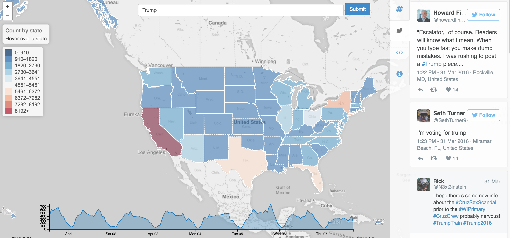

# Data-Analysis-of-Twitter-Tweets

This project introduces AFrame, a new scalable data analysis package powered by a Big Data management system that extends the data scientist's familiar DataFrame operations to efficiently operate on managed data at scale. The first step was collecting data from Twitter using Twitter’s OAuth API and hashtags to specifically target certain categories. The second step was anaylyzing the tweets for insights using AFrames, which is implemented as a layer on top of Apache AsterixDB, transparently scaling out the execution of DataFrame operations and machine learning model invocation through a parallel, shared-nothing big data management system.

# References

https://asterixdb.apache.org/

https://arxiv.org/pdf/1908.06719.pdf

http://cloudberry.ics.uci.edu/

